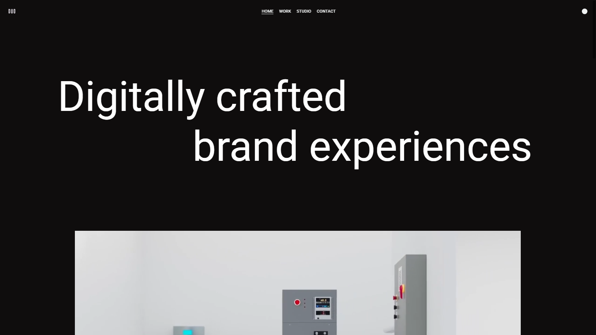
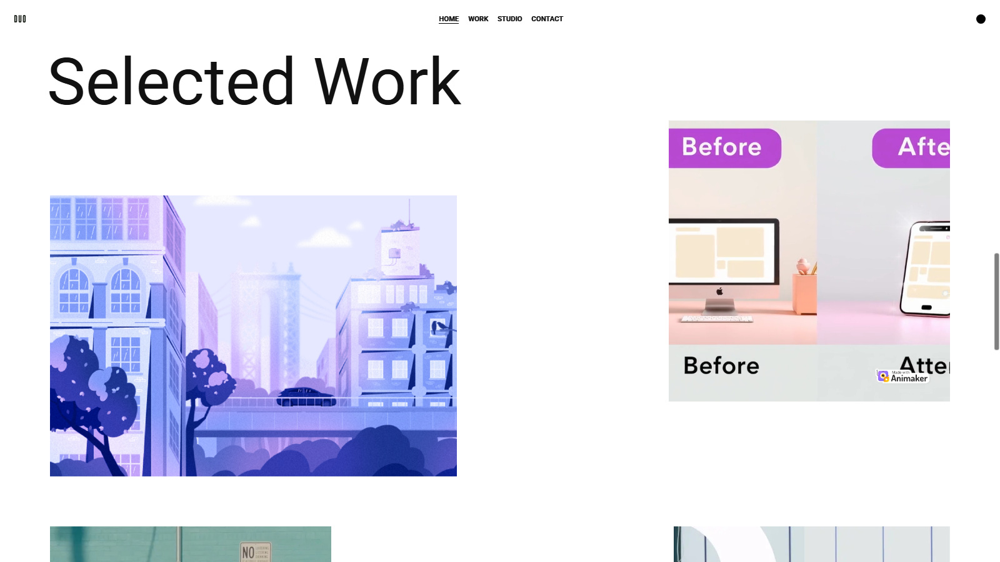

# 🚀 Animated Website with Locomotive Scroll, GSAP, and Custom Cursor

This is a modern, animated website that uses smooth scrolling with Locomotive Scroll, scroll-triggered animations via GSAP, and a custom cursor effect using vanilla JavaScript. All code is written in a single HTML file for simplicity.

---

## 🌐 Live Preview

[Click here to view the demo](https://animation-website-pied.vercel.app/)

---

## 📸 Screenshots

---

## 🛠️ Technologies Used

- HTML5
- CSS3
- JavaScript
- [GSAP (GreenSock)](https://greensock.com/gsap/)
- [Locomotive Scroll](https://locomotivemtl.github.io/locomotive-scroll/)

---

## 📂 File Structure

